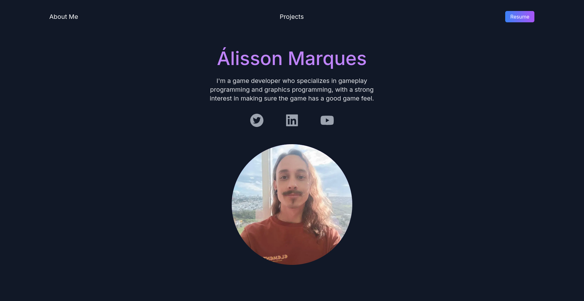

<h1 align="center"> Portfolio </h1>
<a href="https://alissonthx-portfolio.vercel.app"></a>
<p align="center"> Personal portfolio with deploy in Vercel</p>

<h2>🛠️ Tech Stack</h2>
<ul>
<li>
Next Js
</li>	
<li>
Tailwind CSS
</li>
<li>
HTML
</li>
<li>
Vercel
</li>
<u>
	
<h2> How to start application?</h2>
	
```bash
# Install cli react, using npm:
$ npm add create-react-app

# Create react application
$ npx create-react-app
	
# Starting react application
$ npm start
```

<h3 align="center"> 
	Status: 🚀 Done
</h3>
